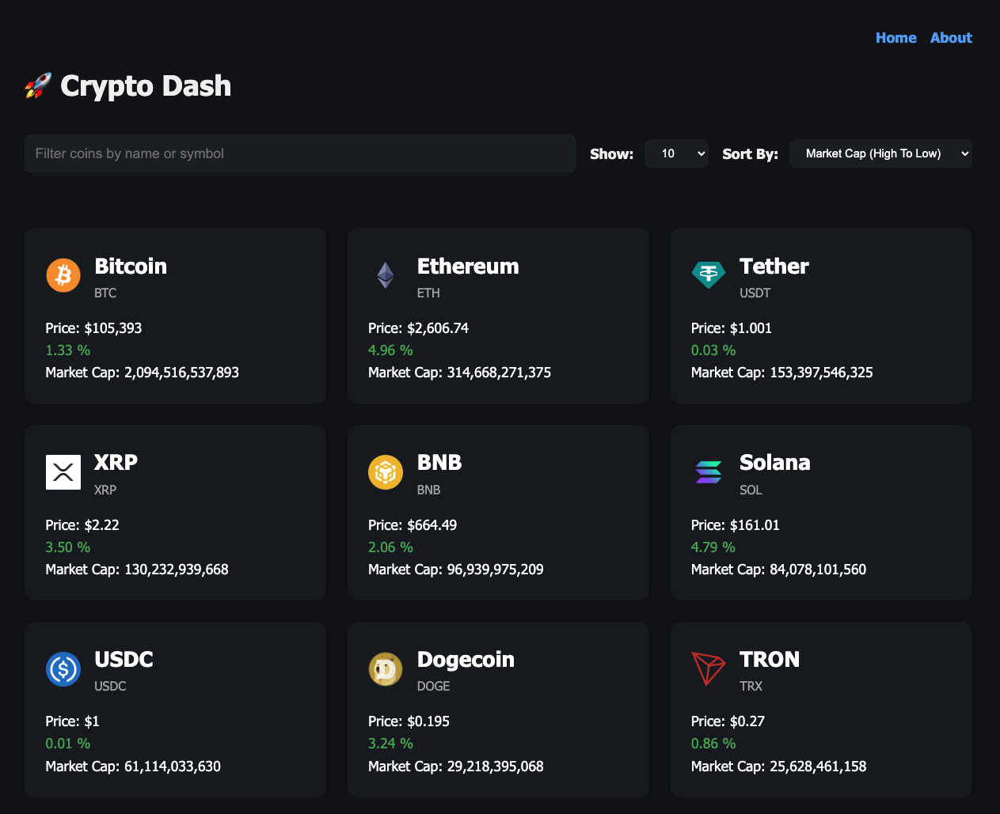

# Crypto Dash

A modern React dashboard for exploring cryptocurrency markets using the CoinGecko API. This project is built with Vite, React Router, and Chart.js to provide a fast, responsive interface for browsing coin data and viewing detailed market trends.



## 🚀 Features

- Browse the top cryptocurrencies by market cap
- Search and filter coins by name or symbol
- Sort coins by market cap, price, or 24h change
- Select how many coins to display per page
- View detailed coin pages with:
  - current price, market cap, supply, and 24h range
  - latest price change statistics
  - official homepage and blockchain explorer links
  - 7-day price chart powered by Chart.js
- Responsive navigation with React Router and a dedicated About page

## 🧱 Tech Stack

- React 19
- Vite
- React Router 7
- Chart.js + react-chartjs-2
- CoinGecko API
- ESLint

## 📁 Project Structure

- `src/App.jsx` — main app layout, routing, and API fetch for the coin list
- `src/pages/home.jsx` — homepage, filters, sorting, and coin grid
- `src/pages/coin-details.jsx` — individual coin detail page with chart and market data
- `src/components` — reusable UI components such as cards, selectors, filter input, and spinner

## ⚙️ Setup

1. Install dependencies:

```bash
npm install
```

2. Create a `.env` file in the project root with the required API endpoints:

```env
VITE_COINS_API_URL=https://api.coingecko.com/api/v3/coins/markets?vs_currency=usd
VITE_COIN_API_URL=https://api.coingecko.com/api/v3/coins
```

3. Start the development server:

```bash
npm run dev
```

4. Open the app in your browser at the URL shown in the terminal.

## 📦 Available Scripts

- `npm run dev` — start the development server
- `npm run build` — create a production build
- `npm run preview` — locally preview the production build
- `npm run lint` — run ESLint across the project

## 📝 Notes

- The app fetches live coin data from CoinGecko, so an active internet connection is required.
- The coin details page loads the selected coin and renders a 7-day price chart.

## 💡 Future Improvements

- add pagination for large coin data sets
- support currency switching (USD, EUR, GBP, etc.)
- add dark mode and accessibility improvements
- cache API responses for faster page loads

## 📚 References

- [CoinGecko API](https://www.coingecko.com/)
- [Vite](https://vitejs.dev/)
- [React Router](https://reactrouter.com/)
- [Chart.js](https://www.chartjs.org/)
